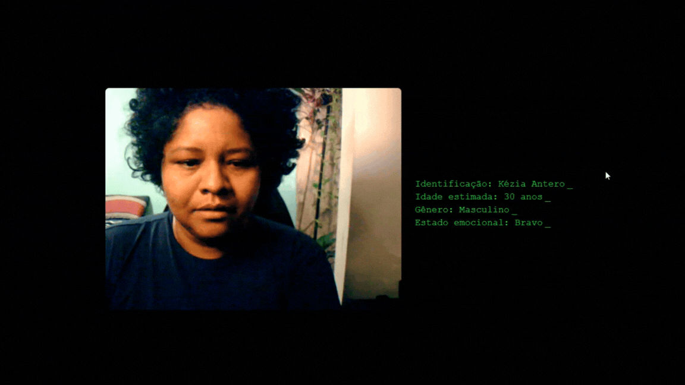

# Reconhecimento Facial em Tempo Real com `face-api.js`

Este projeto é uma aplicação de reconhecimento facial em tempo real usando a API de WebRTC e a biblioteca `face-api.js`. A aplicação detecta rostos a partir da webcam do usuário, identificando idade, gênero e expressões faciais, além de reconhecer rostos previamente treinados.



## Funcionalidades

- **Captura de vídeo da webcam**: Detecta e exibe o feed de vídeo da câmera do usuário.
- **Reconhecimento Facial**: Identifica rostos conhecidos com base em imagens pré-treinadas.
- **Detecção de Expressões Faciais**: Exibe expressões como "Feliz", "Triste" e "Bravo", com tradução para o português.
- **Análise de Idade e Gênero**: Calcula e exibe estimativas de idade e gênero para cada rosto detectado.

## Pré-requisitos

- Navegador com suporte para WebRTC e `navigator.mediaDevices`.
- Biblioteca `face-api.js` incluída em seu projeto (disponível em `/assets/lib/face-api/models`).

## Estrutura do Projeto

- **`index.html`**: Contém o layout básico e elementos de exibição.
- **`script.js`**: Código principal que lida com a captura de vídeo, detecção de rosto e exibição das informações.
- **`/assets/lib/face-api/models`**: Contém os modelos da biblioteca `face-api.js` necessários para detecção de rostos, expressões, idade e gênero.

## Como Usar

1. **Clonar o repositório**:
    ```bash
    git clone https://github.com/KeziAntero/Reconhecimento-Facial.git
    ```

2. **Instalar dependências**:
   Não há dependências específicas além do arquivo `face-api.js`, mas certifique-se de que o projeto contém os modelos da biblioteca `face-api.js` em `/assets/lib/face-api/models`.

3. **Configurar o Projeto**:
   - Certifique-se de que as imagens de rosto para reconhecimento estejam no diretório `/assets/lib/face-api/labels/NOME_LABEL/`, onde `NOME_LABEL` é o nome da pessoa (ex.: "Kézia Antero").
   - As imagens para cada pessoa devem estar numeradas (`1.jpg`, `2.jpg`, `3.jpg`), conforme o código busca essas três fotos para cada label.

4. **Executar o Projeto**:
   - Abra o arquivo `index.html` em um navegador que suporte WebRTC.
   - Permita o acesso à câmera quando solicitado.
   - O feed de vídeo será exibido com informações de idade, gênero, expressão e, caso reconhecido, o nome da pessoa.

## Explicação do Código

- **Captura de Vídeo**: A função `startVideo()` identifica a câmera (ex.: "GENERAL WEBCAM") e exibe o feed de vídeo no elemento `cam`.
- **Carregamento de Labels**: A função `loadLabels()` carrega imagens pré-salvas para comparar rostos reconhecidos.
- **Mapeamento de Expressões**: A função `translateExpression()` traduz as expressões faciais identificadas para português.
- **Processamento em Tempo Real**: As detecções são realizadas a cada 100ms, identificando idade, gênero, expressão e correspondência de rostos, desenhando as informações no `canvas`.

## Tecnologias Utilizadas

- **JavaScript** para manipulação do DOM e processamento em tempo real.
- **WebRTC** para capturar o vídeo da webcam.
- **face-api.js** para análise de rostos, detecção de expressões, idade, gênero e reconhecimento facial.
